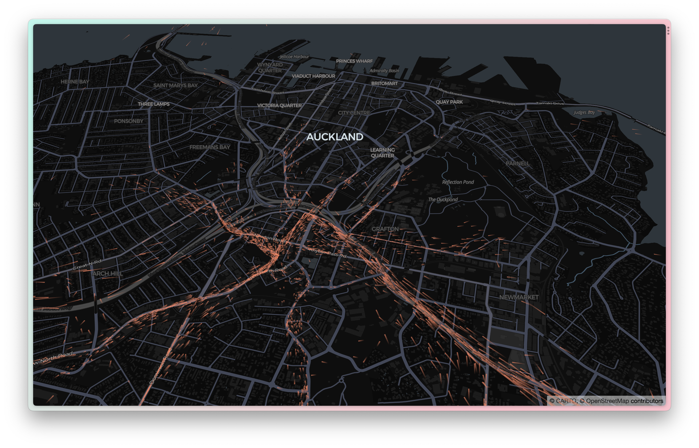

# towing.utf9k.net

> An animated timelapse, powered by [deck.gl](https://deck.gl/) of vehicles towed in Auckland, New Zealand between August 2016 and July 2019

The following repo contains the source code that powers [towing.utf9k.net](https://towing.utf9k.net)

## Usage

This repo is relatively static with `routes.json` having already been precomputed.

Running `yarn start` will open a dev server, used for tweaking the properties of the deck.gl visualisation while `yarn build` will build a `dist` folder with the contents used for the live website

## Data source

The various scripts and data sets that were used to generate `routes.json` can be found in my datasets repo: https://github.com/marcus-crane/datasets/tree/main/auckland-towing

It's pretty inaccessible at the moment as I need to write some documentation.

Ideally, there'll be an accompanying blog post detailing the various steps I took to generate the dataset used for this repo.